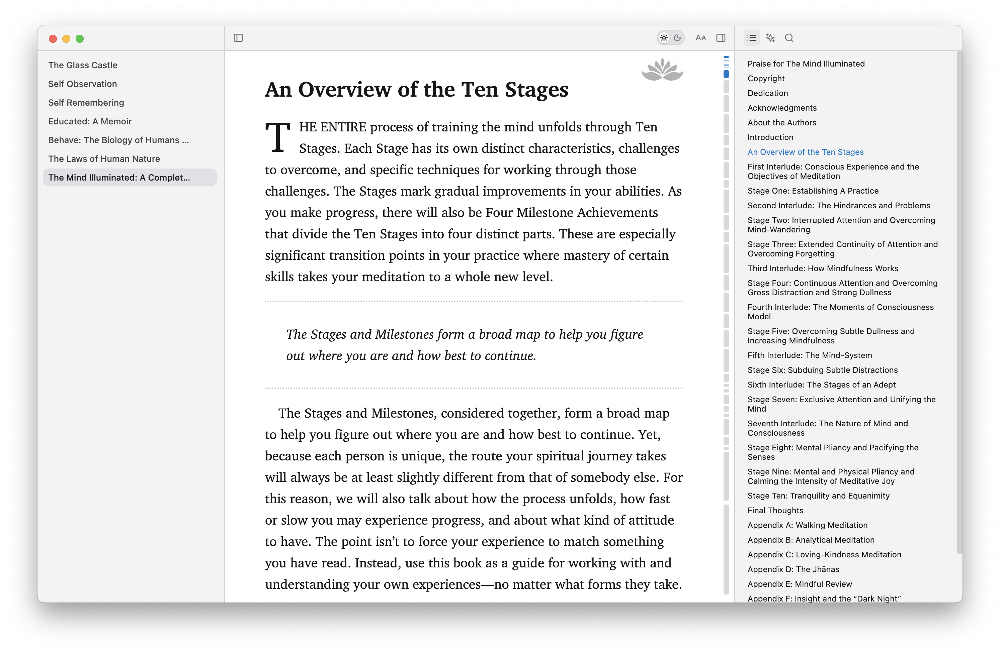

# Gull — A Pure EPUB Reader

Gull is a minimalist, distraction-free EPUB reader for macOS. Designed with a focus on typography and readability, it provides a premium reading experience inspired by modern e-book aesthetics.



## ✨ Features

- **Pristine Reading Experience**: A clean, distraction-free interface that puts the focus entirely on your content.
- **Creative Chapter-Based Scrollbar**: A unique, segmented scrollbar that visualizes the entire book's structure.
- **Customizable Styles**: Personalize your reading experience by adjusting fonts (Inter, Charter, Open Sans, etc.), font sizes, line heights, and paragraph spacing.
- **Native macOS Experience**: Support for file associations (`.epub`), drag-and-drop, and a refined UI that feels right at home on macOS.

## 🚀 Getting Started

### Prerequisites

- [Node.js](https://nodejs.org/) (Latest LTS recommended)
- [npm](https://www.npmjs.com/)

### Installation

1. Clone the repository:
   ```bash
   git clone https://github.com/limboy/gull.git
   cd gull
   ```

2. Install dependencies:
   ```bash
   npm install
   ```

### Development

Start the development server with Hot Module Replacement (HMR) for the renderer and auto-reloading for the main process:

```bash
npm run dev
```

### Building for Production

To pack the application for macOS (`.dmg`):

```bash
npm run build
```

The output will be available in the `dist` directory.

> [!TIP]
> **Notarization**: If you want to use an Apple Developer account for notarization, make sure to set the following environment variables in your `.env` file (see `.env.example`):
> - `APPLE_ID`: Your Apple ID email.
> - `APPLE_APP_SPECIFIC_PASSWORD`: An app-specific password created at [appleid.apple.com](https://appleid.apple.com).
> - `APPLE_TEAM_ID`: Your Apple Team ID.
>
> You also need to have a valid **Developer ID Application** certificate in your macOS Keychain.

## 🛠 Tech Stack

- **Core**: [Electron](https://www.electronjs.org/)
- **Frontend**: [React](https://reactjs.org/) + [Vite](https://vitejs.dev/)
- **Styling**: [Tailwind CSS](https://tailwindcss.com/) + [Radix UI](https://www.radix-ui.com/)
- **EPUB Parsing**: [cheerio](https://cheerio.js.org/) & [adm-zip](https://github.com/cthackers/adm-zip)
- **Icons**: [Lucide React](https://lucide.dev/)

## 📄 License

This project is licensed under the **ISC License**. 

---

Made with ❤️ for readers.
